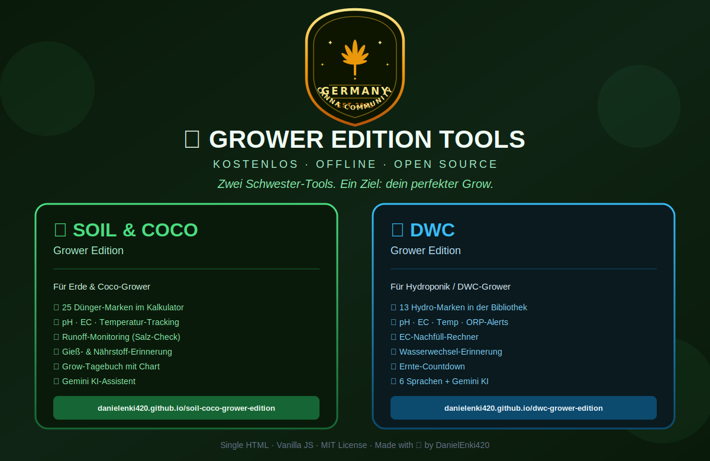

# 🌱 Grower Edition Tools — Die Geschwister

**Zwei Schwester-Tools. Ein Ziel: dein perfekter Grow.**

Zwei kostenlose, offline-fähige Grow-Dashboards — entwickelt für Heim-Grower, die Kontrolle lieben, aber keine Lust auf Cloud-Accounts, Abos oder komplizierte Installationen haben.

| Tool | Für wen? | Live |
|------|----------|------|
| 🌍🥥 **Soil & Coco Grower Edition** *(dieses Repo)* | Erde- & Coco-Grower | [danielenki420.github.io/soil-coco-grower-edition](https://danielenki420.github.io/soil-coco-grower-edition/) |
| 💧 **DWC Grower Edition** | Hydroponik / Deep Water Culture | [danielenki420.github.io/dwc-grower-edition](https://danielenki420.github.io/dwc-grower-edition/) |

Beide Tools sind **eine einzige HTML-Datei**. Kein Server, kein Login, keine Cloud, keine Werbung. Du öffnest sie im Browser — fertig.

---

## 🌍🥥 Soil & Coco Grower Edition

Für alle, die in **Erde**, **Coco** oder einem **Coco+Erde Mix** growen.

- 🥥🌍 Substrat-Umschalter — Zielwerte passen sich automatisch an
- 🌡️ pH · EC · Temperatur-Tracking mit Substrat-spezifischen Zielbereichen
- 🔁 Runoff-Monitoring — erkennt Salzansammlung im Medium
- 💧 Gieß- & Düngererinnerung (jedes 1., 2. oder 3. Gießen)
- 🧪 Nährstoff-Rechner für **25 Marken** mit wochenweisen Dosierplänen
- 📈 Verlaufs-Charts (Chart.js)
- 📝 Grow-Tagebuch mit lokaler Speicherung
- 🤖 Gemini KI-Assistent (optional, eigener API-Key)
- 🌍 4 Sprachen: Deutsch · English · Italiano · Español

**Unterstützte Marken:** Hesi · Canna Aqua · Canna Terra · Canna Coco · Plagron Hydro · Plagron Soil · Plagron Coco · GHE Flora Series · Terra Aquatica · Advanced Nutrients · Athena · Biobizz · BioTabs · Aptus · Mills · Remo · Cyco · House & Garden · Atami B'Cuzz · Dutch Pro · Shogun · BAC · Metrop · Top Crop · Green House Feeding

## 💧 DWC Grower Edition

Für alle, die in **Deep Water Culture** oder **Hydroponik** growen.

- 💧 pH · EC · Temp · ORP-Alerts mit Phasen-spezifischen Ranges
- 🧪 13 Hydro-Marken in der Dünger-Bibliothek
- ⚗️ EC-Nachfüll-Rechner (für Verdunstung & Nachdüngung)
- 🔄 Wasserwechsel-Erinnerung
- ⏳ Ernte-Countdown
- 📈 Verlaufs-Charts
- 🤖 Gemini KI-Assistent
- 🌍 6 Sprachen

---

## 🖥️ Installation für Einsteiger

Keine Kommandozeile. Keine Installation. Wirklich.

### 🍎 Auf dem Mac

1. Klick oben rechts auf **`Code`** → **`Download ZIP`**
2. Doppelklick auf die ZIP im Download-Ordner → entpackt sich automatisch
3. Öffne den entstandenen Ordner → finde die Datei **`index.html`**
4. Doppelklick auf `index.html` → öffnet sich im Browser (Safari/Chrome)
5. Fertig. 🎉 Du kannst die Seite als Lesezeichen speichern.

*Tipp:* In Safari → **`Ablage`** → **`Zum Dock hinzufügen`** macht daraus eine App.

### 🪟 Auf Windows

1. Klick oben rechts auf **`Code`** → **`Download ZIP`**
2. Rechtsklick auf die ZIP im Download-Ordner → **`Alle extrahieren…`**
3. Öffne den entpackten Ordner → finde **`index.html`**
4. Doppelklick auf `index.html` → öffnet sich im Browser (Edge/Chrome)
5. Fertig. 🎉

*Tipp:* In Chrome → **`⋮`** → **`Speichern und teilen`** → **`Verknüpfung erstellen…`** macht daraus eine Desktop-App.

### 📱 Oder einfach online nutzen

Keine Lust auf Download? Nutze die Live-Version direkt im Browser:
- **Soil & Coco:** https://danielenki420.github.io/soil-coco-grower-edition/
- **DWC:** https://danielenki420.github.io/dwc-grower-edition/

Beide funktionieren auch **offline**, sobald einmal geladen — einfach als Lesezeichen speichern oder zum Startbildschirm hinzufügen.

---

## 🎯 Welches Tool für mich?

| Du growst in… | Nimm |
|---------------|------|
| Erde (Light Mix, BioBizz, etc.) | 🌍🥥 **Soil & Coco** |
| Coco/Kokos | 🌍🥥 **Soil & Coco** |
| Coco-Erde-Mischung | 🌍🥥 **Soil & Coco** |
| DWC / Hydro-Bucket | 💧 **DWC** |
| NFT / Aeroponik | 💧 **DWC** (Werte passen auch) |

---

## 🔒 Datenschutz

- **Keine Server.** Alles läuft in deinem Browser.
- **Keine Cookies.** Daten in `localStorage` auf deinem Gerät.
- **Kein Tracking.** Kein Google Analytics, kein Facebook Pixel, nichts.
- **Kein Account.** Öffnen und loslegen.
- **Gemini KI optional** — nur wenn du deinen eigenen kostenlosen API-Key bei [aistudio.google.com](https://aistudio.google.com) holst.

---

## 🛠️ Tech Stack

Single HTML · Vanilla JS · Chart.js (CDN) · kein Build-Step · kein npm · kein Framework.

## 📜 Lizenz

**MIT** — Fork it, share it, grow it. 🌱

Made with ☕ by [DanielEnki420](https://github.com/DanielEnki420)

---
---

# 🌱 Grower Edition Tools — The Siblings

**Two sister tools. One goal: your perfect grow.**

Two free, offline-capable grow dashboards — built for home growers who love being in control, but have no interest in cloud accounts, subscriptions, or complicated setups.

| Tool | For whom? | Live |
|------|-----------|------|
| 🌍🥥 **Soil & Coco Grower Edition** *(this repo)* | Soil & Coco growers | [danielenki420.github.io/soil-coco-grower-edition](https://danielenki420.github.io/soil-coco-grower-edition/) |
| 💧 **DWC Grower Edition** | Hydroponics / Deep Water Culture | [danielenki420.github.io/dwc-grower-edition](https://danielenki420.github.io/dwc-grower-edition/) |

Both tools are **a single HTML file**. No server, no login, no cloud, no ads. Open in browser — done.

---

## 🌍🥥 Soil & Coco Grower Edition

For everyone growing in **soil**, **coco**, or a **coco+soil mix**.

- 🥥🌍 Substrate selector — target values adjust automatically
- 🌡️ pH · EC · Temperature tracking with substrate-specific target ranges
- 🔁 Runoff monitoring — detects salt build-up in the medium
- 💧 Watering & feeding reminder (every 1st, 2nd or 3rd watering)
- 🧪 Nutrient calculator for **25 brands** with week-by-week dosing schedules
- 📈 History charts (Chart.js)
- 📝 Grow diary with local storage
- 🤖 Gemini AI assistant (optional, own API key)
- 🌍 4 languages: Deutsch · English · Italiano · Español

**Supported brands:** Hesi · Canna Aqua · Canna Terra · Canna Coco · Plagron Hydro · Plagron Soil · Plagron Coco · GHE Flora Series · Terra Aquatica · Advanced Nutrients · Athena · Biobizz · BioTabs · Aptus · Mills · Remo · Cyco · House & Garden · Atami B'Cuzz · Dutch Pro · Shogun · BAC · Metrop · Top Crop · Green House Feeding

## 💧 DWC Grower Edition

For everyone growing in **Deep Water Culture** or **hydroponics**.

- 💧 pH · EC · Temp · ORP alerts with phase-specific ranges
- 🧪 13 hydro brands in the nutrient library
- ⚗️ EC top-up calculator (for evaporation & nutrient correction)
- 🔄 Water change reminder
- ⏳ Harvest countdown
- 📈 History charts
- 🤖 Gemini AI assistant
- 🌍 6 languages

---

## 🖥️ Installation for Beginners

No terminal. No installation. Seriously.

### 🍎 On Mac

1. Click **`Code`** → **`Download ZIP`** in the top right
2. Double-click the ZIP in your Downloads folder → extracts automatically
3. Open the folder → find the file **`index.html`**
4. Double-click `index.html` → opens in your browser (Safari/Chrome)
5. Done. 🎉 Save it as a bookmark.

*Tip:* In Safari → **`File`** → **`Add to Dock`** turns it into an app.

### 🪟 On Windows

1. Click **`Code`** → **`Download ZIP`** in the top right
2. Right-click the ZIP in your Downloads folder → **`Extract All…`**
3. Open the extracted folder → find **`index.html`**
4. Double-click `index.html` → opens in your browser (Edge/Chrome)
5. Done. 🎉

*Tip:* In Chrome → **`⋮`** → **`Save and share`** → **`Create shortcut…`** turns it into a desktop app.

### 📱 Or just use it online

Don't want to download anything? Use the live version directly in your browser:
- **Soil & Coco:** https://danielenki420.github.io/soil-coco-grower-edition/
- **DWC:** https://danielenki420.github.io/dwc-grower-edition/

Both work **offline** once loaded — just save as a bookmark or add to your home screen.

---

## 🎯 Which tool is right for me?

| You grow in… | Use |
|--------------|-----|
| Soil (Light Mix, BioBizz, etc.) | 🌍🥥 **Soil & Coco** |
| Coco / Coconut fibre | 🌍🥥 **Soil & Coco** |
| Coco-soil mix | 🌍🥥 **Soil & Coco** |
| DWC / Hydro bucket | 💧 **DWC** |
| NFT / Aeroponics | 💧 **DWC** (values apply too) |

---

## 🔒 Privacy

- **No servers.** Everything runs in your browser.
- **No cookies.** Data stored in `localStorage` on your device.
- **No tracking.** No Google Analytics, no Facebook Pixel, nothing.
- **No account.** Open and go.
- **Gemini AI optional** — only if you get your own free API key at [aistudio.google.com](https://aistudio.google.com).

---

## 🛠️ Tech Stack

Single HTML · Vanilla JS · Chart.js (CDN) · no build step · no npm · no framework.

## 📜 License

**MIT** — Fork it, share it, grow it. 🌱

Made with ☕ by [DanielEnki420](https://github.com/DanielEnki420)
